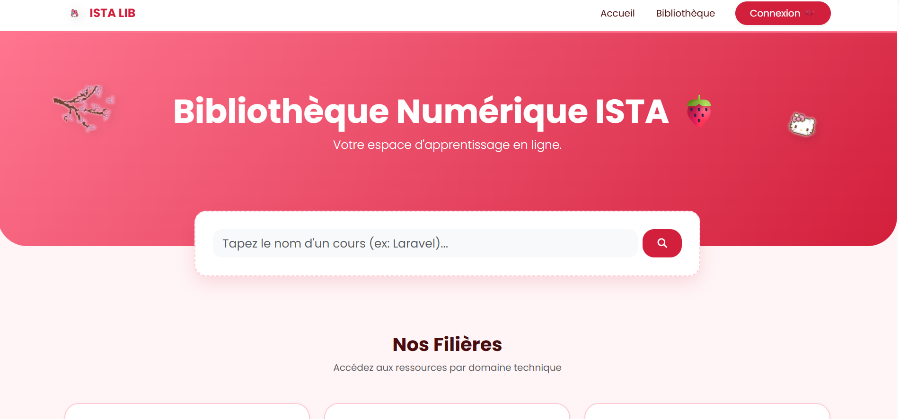
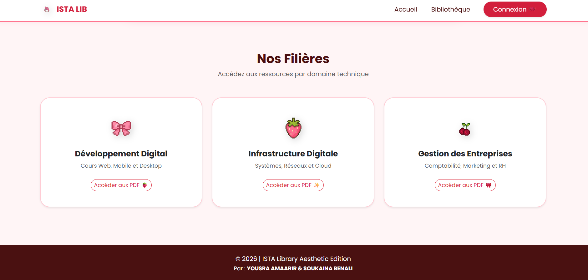
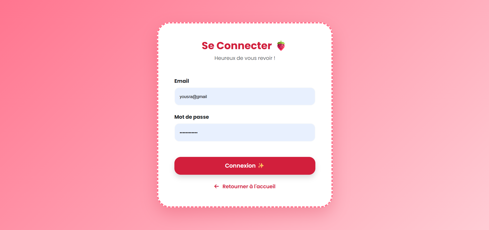
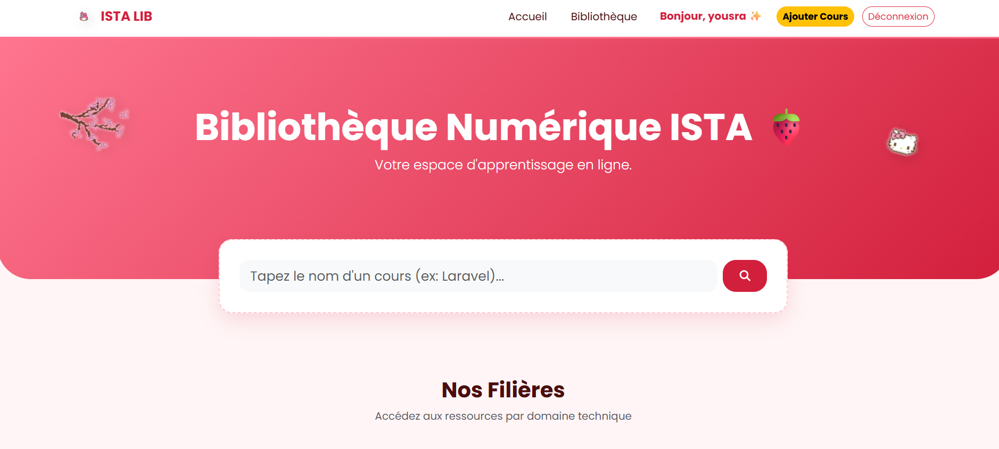
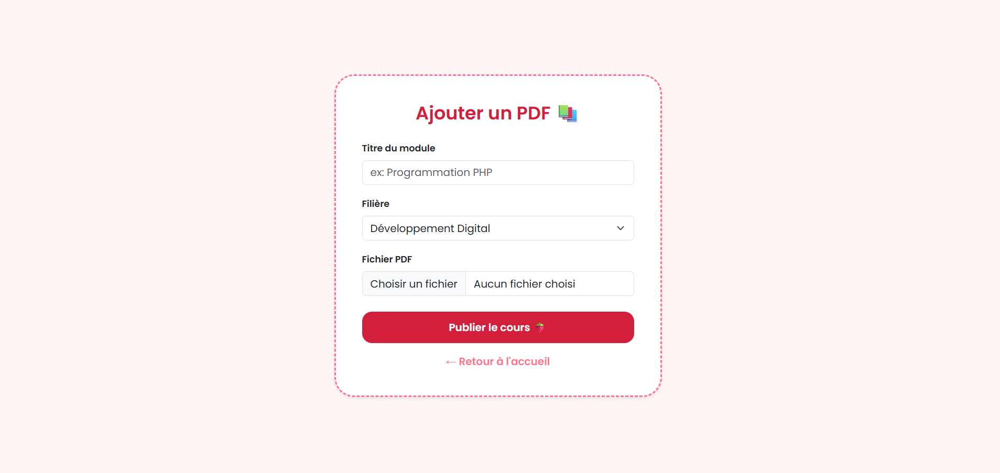
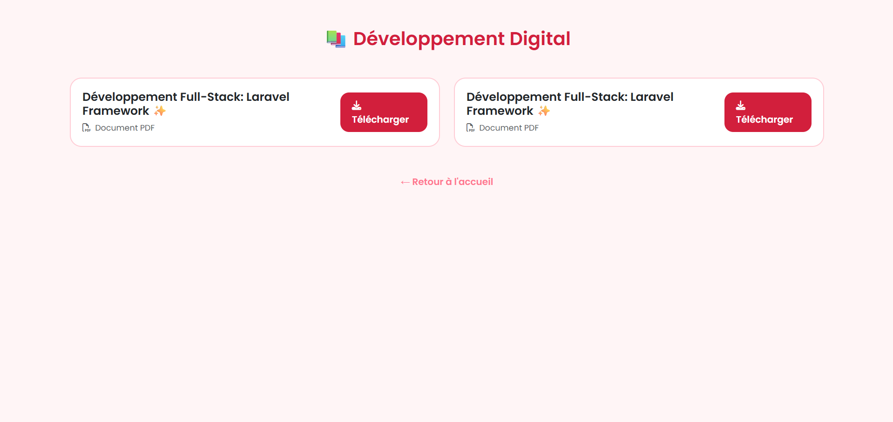

# 📚 Système de Gestion de Bibliothèque - ISTA

## 📝 Description
Application web Full-stack développée pour la gestion numérique de la bibliothèque de l'ISTA. Ce projet permet de gérer les ouvrages, les emprunts et les comptes étudiants de manière efficace et sécurisée.

## 🚀 Fonctionnalités Clés
* **Gestion des Livres (CRUD):** Ajouter, modifier et supprimer des ouvrages.
* **Système d'Authentification:** Accès sécurisé pour l'admin et les étudiants.
* **Recherche Dynamique:** Filtrage par titre, auteur ou catégorie.
* **Tableau de Bord:** Vue d'ensemble sur les statistiques et les emprunts en cours.

## 🛠️ Stack Technique
* **Frontend:** HTML5, CSS3, JavaScript, Bootstrap.
* **Backend:** PHP (Native).
* **Base de données:** MySQL.

## 📸 Aperçu du Projet (Screenshots)

### 🖥️ Interface Principale & Login
<table>
  <tr>
    <td> Interface d'accueil</td>
    <td> Page de Connexion</td>
  </tr>
</table>

### 📊 Dashboard & Gestion
<table>
  <tr>
    <td> Tableau de bord Admin</td>
    <td> Liste des ouvrages</td>
  </tr>
</table>

### 🔍 Recherche & Emprunts
<table>
  <tr>
    <td> Système de recherche</td>
    <td> Gestion des emprunts</td>
  </tr>
</table>

---
## 📧 Contact
Développé par **[Yousra Amaarir]** - Étudiante en Développement Web Full-stack.
